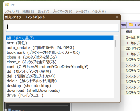

# 秀丸ファイラーコマンドパレット
 

[作者: suzu](https://github.com/hiro111suzu/hidemaru_docs/blob/main/README.md) /
[バージョン: 1](https://github.com/hiro111suzu/cmdp_hidemaru_filer/releases/) /
[GitHub](https://github.com/hiro111suzu/cmdp_hidemaru_filer) /
[公式ライブラリ](https://hide.maruo.co.jp/lib/hmfcscript/cmdphf_v1.html)

# 概要
* 「コマンドパレット」を、秀丸ファイラーClassic(以下、秀丸ファイラー)ーに導入するスクリプトです。
* コマンドパレットとは、
	+ 検索型コマンド入力インターフェイスから、各種コマンドを呼び出す機能です。
	+ vscodeやWindows Termianlに搭載されていることで知られています。
	+ 望みのコマンドを多数の候補から簡単なキーボード操作で探し出して実行できるので、コマンド数が多くなっても破綻しにくく、近年流行しているインターフェイスです。
	+ （実はこのプロジェクトはコマンドパレットのインスパイアではなくて、17年前から作り続けている"comalan"という秀丸マクロの後継です）
* コマンド設定は、TSV形式（タブ区切り形式）のテキストファイルを編集して登録する方式です。
	+ サンプルとして100以上のコマンドが登録されています。多彩な機能を簡単に試すことができます。
	+ 簡単な書式で多数の独自コマンドを登録できます。
	+ フォルダーを開く、ファイル・フォルダーを特定のアプリで開く、秀丸ファイラーコマンド、JScript文、外部スクリプトの実行など、幅広い機能を利用してコマンドを作成できます。
	+ コマンドごとに、特定の拡張子のファイル選択時のみ表示されるような設定も可能です。
		- 独自メニューにまとめれば、「ポチエス」というソフトウェアに近い機能を作成できます。
* 作成したコマンドには、以下の使い道があります。
	+ コマンドパレットのコマンドとして
	+ 独自メニューのメニューアイテムとして
	+ 秀丸ファイラーに単独のツールとして登録、あるいは外部プログラムから呼び出し
		- スクリプト本体 *cmdp.js* の引数として呼び出す
		- マウスジェスチャーでメニューを出すような設定をすれば、マウス向けの機能拡張ツールにもなる
* 秀丸エディタ用の同様のマクロも公開しています。
	+ 併用すれば、エディタ、メール、ファイラーで同様のコマンド入力インターフェイスを利用できるようになります。
* テキストファイルのみの設定なので、機能の同期・複製・テスト・コメントアウトなど、管理が簡単です。

# インストール
* *cmdp.js* をスクリプト登録し、キーを割り当てます。
	+ 好みに応じて徹底的にカスタマイズしてください。

## コマンドパレットのウインドウについて
* コマンドパレットのウインドウは、*macrodll.dll* の *"EDIT_CREATE"* を利用しています。
* 32bit版秀丸ファイラー用の *macrodll-32.dll* と、64bit版秀丸ファイラー用の *macrodll-64.dll* が同梱されています。
	+ *macrodll.dll* は、あべのり氏が開発したものです。
		- [あべのり氏のサイトの、macrodll.dllが公開されているページ](https://www.ms.u-tokyo.ac.jp/~abenori/soft/hidemaru.html)
	+ その64bit対応版はh-tom氏によるものです。
		- [h-tom氏のサイトの、macrodll.dllが公開されているページ](http://htom.in.coocan.jp/macro/macro_dll.html#label-2)
	+ 両氏の許可を得て本パッケージに同梱してあります。
	+ 両ファイルを同じディレクトリにおけるようにファイル名を変更してあります。
		- オリジナルはどちらも "*macrodll.dll*"
* 同梱のdllファイルは、32bit版、64bit版ともに、以下のような改造が施されています。
	+ コマンドパレットとして使いやすいようウインドウと構成要素を大きくし、フォントをモダンなMeiryo-UIに変更
	+ 改造には、[*RisohEditor*](https://katahiromz.web.fc2.com/re/ja/)を利用
	+ *EDIT_CREATE* ツールのリソースは、"RT_DIALOG"の102に記述されていて、フォントの種類・サイズ、各要素の大きさなどが編集可能（プログラミングの環境も知識も必要なく、簡単に変更できます）

## ファイルの説明
* *cmdp.js*
	+ コマンドパレットのスクリプト本体
* *cmdp.tsv*
	+ 設定用TSVファイル
	+ この文書では、単に「TSVファイル」と表記
* *tool.js*
	+ ユーザースクリプトファイル
		- サンプルとしていくつかツールが書き込まれているが
	+ 少し短めのスクリプトは、ここに書き込んでTSVにコマンド登録すると便利
		- 数行程度のスクリプトなら、TSV内に直接記述するのが楽
* *common.js*
	+ *cmdp.js* と *tool.js* の両方で使うメソッドなどを定義している
	+ ここで定義されているメソッドなどは、TSVの *js* キーのJScript文や、*tool.js*スクリプト内の自作関数からも利用可能
* macrodll-32.dll / macrodll-64.dll
	+ 上述の *macrodll.dll*
* readme.html
	+ この文書

# 操作方法
* *cmdp.js* がコマンドパレットのスクリプト本体です。
* コマンドパレットを起動すると、上部に**コマンドの入力ボックス**、下部に**コマンドの候補ボックス**をもつウインドウが表示されます。
	+ 入力ボックスに文字を入力するごとに、候補が絞り込まれます。
	+ 上下キーか、スペースキー、shift+スペースキーで候補の移動ができます。
	+ タブキーで部分確定、 エンターキーで実行、エスケープキーでキャンセルです。
	+ エンターキーを押すときに、[Shift]キー、[Ctrl]キーを押していると動作が変わります。(v1.1新機能)
		- [Shift]キーを押していた場合、TSVファイル中のそのコマンドをを定義している部分にジャンプします。
		- [Ctrl]キーを押していた場合は、コマンドの実行対象となるスクリプトがあればそれを開きます。ない場合は[Shift]キーと同様、TSVファイルを開きます。
	+ *macrodll.dll* の *EDIT_CREATE* の仕様で、検索は先頭一致のみです。
* サンプルとして登録されている *split* を実行してみます。
	+ コマンドパレットを起動し、"split"と入力します。
		- おそらく、2文字目、"sp"を入力した時点で、splitにヒットするはずです。
	+ エンターキーを押して実行。
		- 画面の分割モードが切り替わります。

# コマンド
## コマンド文
* コマンド文は、「**コマンド名**」と「**コマンド引数**」(省略可能)からなる
* コマンド名とコマンド引数の区切りは、";"（セミコロン）
	+ *EDIT_CREATE* ではスペースが入力できないので、このような仕様となっている
	+ 秀丸エディタ版コマンドパレットとは仕様が異なる
* キャプション（コマンドの説明）部分は**無視される**
	+ タブキーで自動補完するとキャプションまで入ってしまうこともあるが、そのまま実行可能
		- ```filt  (フィルター)``` → ```filter```と同じ
	+ キャプションを消さなくても、";"（セミコロン）で引数を書き込める
		- ```filt  (フィルター);hoge``` → ```filter;hoge```と同じ
* コマンド引数は、スクリプトやプログラム実行時にその引数として渡される
	+ 例: filtコマンドは、引数文字列をキーワードとしてファイル一覧を絞り込む（引数を省略すると、キーワードの入力ボックスが出現する）
	+ 引数はTSVファイルで設定することも可能
* コマンドは、"/"（スラッシュ記号）で**グループ化**できる
	+ 例: ```hoge/fuga``` は"hoge"グループに含まれる"fuga"というコマンドとなる
	+ "/"で終わるコマンドは、「グループコマンド」となる
		- グループコマンドを実行すると、そのグループに含まれるコマンドのみのコマンドパレット（グループモード）が再表示される
		- 「非表示」指定のコマンドも、グループモードでは表示される
	+ グループコマンドは、**メニューにもなる**
		- メニューのコマンド名は、"menu/グループ名"となる（つまり、それ自体が"menu"というグループに属したコマンドにもなる）
	+ サンプルとして、"help/"や"conf/"が登録されている

## コマンドの機能・動作
* 「**表示**」されるコマンドと、「**非表示**」のコマンドがある
	+ 「非表示」とはコマンドパレットの候補リスト及び、独自メニューに**表示されない**という意味
	+ 「非表示」でも**実行は可能**、コマンドが無効になるわけではない
	+ 設定と状態次第で、各コマンドの「表示」「非表示」が切り替わる
* 登録されていないコマンドが入力された場合、以下の実行を試みる
	+ そういう名前のスクリプトがあれば、それを実行。
		- うまく実行できないこともある（秀丸ファイラーの仕様）
	+ そういうフォルダーがあれば、それを開く
	+ パスらしき文字列なら、それを開く。
* 作成したコマンドを外部から実行することも可能
	+ *cmdp.js*スクリプトを**引数つき**で呼び出すと、コマンドパレットウインドウを表示せず、その引数文字列を**コマンド文と解釈**して実行する
	+ この機能を利用すれば、以下の様なことも可能
		- 特定のコマンドを**スクリプト登録**し、キーやマウスジェスチャーで直接実行できるようにする
		- **ブックマーク**に入れる

## 独自メニュー
* 独自メニューを出すコマンドを作成可能
	+ 任意の「コマンド」の集合をメニューにする機能
	+ 後述の、TSVファイルの *menu* キーの値に、コマンド名を記述して設定する
	+ 前述の「グループコマンド」も、メニュー化される
* いわゆる「ポチエス」型のメニューを作成可能
	+ （ここでは、フォーカスアイテムの種類によってアイテムが切り替わるメニューを「ポチエス」型と表現、以前そういう名前のソフトウェアがあった）
	+ メニューに登録するコマンドには、後述の *ext* キーで、そのコマンドが対応する拡張子を書き込んでおく
		- たとえば、画像ファイルにフォーカスがあるときは、画像ファイルを開けるソフトのみが表示されるようなメニューになる
	+ 作成したメニューコマンドを「ツール」に登録し、「キー」や「マウスジェスチャー」を割り当てる
		- *cmdp.js* を追加でスクリプト登録し、引数としてそのメニューの「コマンド名」を記述すると、単独のツールのようにそのメニューが直接出現するようになる
* いくつかのメニューコマンドが、サンプルとして予め登録されている
	+ サンプルの"menu/main"コマンドが「ポチエス」風のメニュー
	+ 全てのメニューコマンドは、"menu"というグループに属するコマンドとして登録されている
		- そうする必要がある訳ではない
		- "menu"グループに属するコマンドをメニューにする、"menu/all"（メニューのメニュー）というコマンドも登録されている

# 設定方法
* 付属の *"cmdp.tsv"* (以下、単にTSVファイル) を編集して設定を行います。
	+ このドキュメントより、**まずはTSVファイルを直接見るほうがわかりやすいと思われる**
* 以下で、「**フォーカスアイテム**」とは、秀丸ファイラーのタブ内でカーソルがあたっているファイルのことを指します。
	+ 「**選択**」しているファイルと一致しないことがある
	+ 一つのアイテムだけがフォーカスされている
	+ テキストエディタにたとえると、のカーソル位置の文字が「**フォーカスアイテム**」、選択文字列が「**選択アイテム**」

## TSVファイルについて
* ファイル形式
	+ TSV形式（改行、タブ区切り）のテキストで、**キー・バリュー**形式
	+ 行ごとに、第一セル（最初のタブ前）がキー、第二セル（最初のタブ後）がバリュー（値）となり、第三セル以降は無視される
	+ 文字列の先頭・末尾の空白は無視される
* コメント
	+ "."（ピリオド）か";"（セミコロン）で始まる行は無視されるので、コメントとして利用可能
	+ 第三セル以降もコメントとして利用可能
	+ 付属のサンプルTSVファイルでは、ピリオド1個が見出しレベル1，ピリオド2個が見出しレベル2として、コメント付けされている
* セクション
	+ データは**セクション**で区切られる
		- セクション区切りのあるINI形式と同様のデータ構造となる
		- INI形式では ```[section]``` のように表記される部分のこと
	+ **キー**（**第一セル**）が"@"(アットマーク)の行がセクションの区切りとなり、その行の「**値**」（**第二セル**）が「**セクション名**」となる
	+ セクション名が"_"アンダーバーで始まるものは、「**特殊セクション**」
	+ それ以外のセクションはすべて「**コマンド定義セクション**」
* 同名キー
	+ セクション内で同じキー名が複数ある場合、すべての値が改行区切りで連結される
	+ この書式は、以下の設定で利用される
		- *js* キーでの複数行のスクリプトの記述
		- *menu* キーでメニューアイテムのリスト化
		- *open* キーで複数フォルダーを同時に開く動作
* 真偽値
	+ 大文字小文字関係なく、"yes", "y", "true", "1"のどれかであれば **true (真)** となる
	+ それ以外は **false (偽)** となる、キーが存在しない場合も **false (偽)**
* 環境変数とユーザー定義のパスの展開
	+ 環境変数は"%"で挟む表記で記述可能
		- （例: %PROGRAMFILES%)
	+ 後述する *_path* セクションで定義されたパスも、"%"で挟めば展開される
	+ *js* キーによるスクリプト文中では"%"は使えない。文字列の拡張メソッド *env_expand()* を利用可能。
* 秀丸エディタで最適な編集
	+ 秀丸エディタの**TSVモード**を利用すれば、整形された状態で編集が可能
	+ 先頭のピリオドの数で見出しを定義し、アウトライン枠を表示させれば、大量にコマンドを作っても容易にナビゲートできるようになる
	+ ファイルタイプ別の設定で、セクション区切りの"@"行や、コメント行の色分けをすると、さらにに便利になる

## コマンド定義セクション
### キー名
* セクション名
	+ キー名が"@"（アットマーク）の行でセクション名を指定
	+ "_"で始まるセクション以外、すべてコマンドの定義セクションとなる
	+ セクション名がコマンド名となる
	+ "/"（スラッシュ記号）で、コマンドのグループ化が可能
* *capt*
	+ キャプション。コマンドのひとこと説明
	+ コマンドパレットではコマンド名の後ろに表示される
	+ メニューではメニューアイテムの表示名となる
	+ 省略可能だが、なるべく書かないと自分でわからなくなる
* *cmd*
	+ 秀丸ファイラーコマンド
	+ [秀丸ファイラーのヘルプのコマンド一覧](https://help.maruo.co.jp/hmfilerclassic/hmfilerclassic_command.html)にある文字列をそのまま（記号も含めてそのまま）書く
		- 例: 「フォルダへコピー...」「タブを閉じる(最後の１つ除く)」
* *tool*
	+ *tool.js* スクリプト内の関数を実行する
	+ *tool.js* のグローバルに作成した関数名を記述
	+ *arg* キーで関数に渡す引数を記述
		- *tool.js* スクリプトでは、getArg(1)でも受け取り可能
* *script*
	+ 実行するスクリプトのファイル名
	+ 拡張子".js"、".vbs"は省略可能
	+ cmdp.jsと同じフォルダー、cmdp.jsの親フォルダー（スクリプト用のフォルダーにおいてあると想定）は省略可能
	+ cmdp.jsの親フォルダーにある、フォルダー名と同名のスクリプト名の場合、そのフォルダー名も省略可能
		- 例: [スクリプト用フォルダー]\hoge\hoge.js => hoge
* *js*
	+ JScriptをそのまま記述
	+ *js* キーを複数行使えば、複数行のスクリプトを記述できる
	+ スクリプトは *cmdp.js* 内のグローバルにある無名関数中で実行される
	+ *cmdp.js* スクリプト内で定義されている関数なども使用可能
		- String型の拡張として、ファイル名文字列の処理が楽になりそうなものをいくつか定義している
* arg_input
	+ *js* キーのスクリプト実行前に、引数文字列を受け取るためのテキスト入力ボックスを表示する
	+ ','（カンマ）区切りで、カンマ前にダイアログのメッセージ、カンマ後に入力ボックスの初期値（省略可）を指定
	+ 入力がキャンセルされると、スクリプトは実行されない
	+ コマンド引数を受け取った場合は、入力ボックスは表示されず、その引数がスクリプトに渡される
	+ 引数は *js_arg* というグローバル変数に入った状態でスクリプトが実行される
* *run*
	+ Windowsシェルで開く
	+ ファイル名やURLを記述
		- ```shell:desktop```のようなスキームを書いてもよさそう
* *open*
	+ 秀丸ファイラーのタブで開く
	+ 複数キーに対応
		- *open* キーを複数行記述すれば、複数のフォルダーをまとめて開くコマンドになる
* *openby*
	+ このキーで指定したプログラムで、「フォーカスアイテム」を開く
* *opendirby*
	+ このキーで指定したプログラムで、現在のタブで開いているフォルダーを開く
* openallby
	+ 選択しているファイルすべてを、このキーで指定したプログラムで**まとめて**開く
	+ スペース区切りで複数のファイルパスを受け取れるタイプのプログラムに限る
		- 秀丸エディタなど、かなり限られたソフトのみが対応
* openeachby
	+ 選択しているファイルすべてを、このキーで指定したプログラムで**順番に**開く
		- 一つずつ終了待ちをする
	+ 「複数のアーカイブファイルを一つずつ展開する」などに便利
* *arg*
	+ *script*、*open* などへ渡す引数を指定
* *ext*
	+ 「フォーカスアイテム」が指定拡張子のファイルのときのみ「表示」となる
	+ "folder"でフォルダーも指定可能
	+ ファイルの拡張子をスペース区切りの文字列で指定する
	+ *_ext_type* セクションで指定されている拡張子群をまとめて指定可能
		- 画像なら '_img'、動画なら'_mov'など
* *file_only*
	+ 「フォーカスアイテム」がフォルダーではなく、ファイルのときのみ「表示」となる
* *hidden*
	+ trueを指定すると、そのコマンドは「非表示」となる
* *menu*
	+ 独自メニューを出す
	+ menuキーの値はコマンド名
	+ menuキーを複数行表記する、1行1アイテム
		- ','（カンマ）の後にアクセスキーを指定可能
	+ "-"は区切り線になる
	+ メニューを出すメニューアイテムも設定可能
		- 組み合わせ次第で、複雑な構造のメニューや循環するメニューも作成可能
		- サンプルとして登録されているメニューは、";"キーで循環する

### 使えない文字、使わない方がよい文字
* コマンド名とキャプションに使えない文字（自動的に'_'（アンダーバー）に変更される）
	+ **','（カンマ）**: *EDIT_CREATE* の仕様
	+ **';'（セミコロン）**: コマンドと引数のセパレーターなので
* コマンドに使えない文字列
	+ **'  (': （スペース2個と左カッコ）**: コマンドとキャプションのセパレーターなので
* コマンドに使わないほうがよい文字（コマンド選択が少し面倒になるので）
	+ **大文字**: 大文字小文字は区別されるの仕様
	+ **' '（半角スペース）**: *EDIT_CREATE* の仕様（スペースキーはアイテム選択の上下移動に使うため、直接入力できない仕様）
	+ **その他入力が面倒な文字**: 全角文字など

### 備考
* *tool* や *open* などのキーの値を"-"（ハイフン）とすると、**コマンド名と同じ文字列**とみなされる
* 一つのセクション内に、複数の実行系のキー（*cmd* など）を記述しても、最初のキーしか実行されない
	+ 実行系のキーは、*cmd*, *js*, *menu*, *open*, *openallby*, *openby*, *opendirby*, *openeachby*, *run*, *script*, *tool*
* *open*, *openby*などで指定する実行ファイルのパス文字列は、以下のような省略が可能
	+ *_exe_path*セクションで定義されているディレクトリパス
	+ その中の実行ファイル名と同じディレクトリ名の場合、ディレクトリ名と".exe"も省略できる
	+ たとえば、```c:\Program Files (x86)\hidemaru\hidemaru.exe```は```hidemaru```だけでもよい

## 短縮コマンド定義セクション
* 一部のタイプのコマンドについては、以下のセクション内に記述すれば、**一行で**コマンドの定義が可能

### *_short_cmd* セクション
* *cmd* （秀丸ファイラーコマンド実行）の定義を1行で記述可能
* 書式:[コマンド名]<タブ>[cmdの値]
* 例

```
option	オプション...
```

コマンド定義セクションでの以下と同義

```tsv
@	option
cmd	オプション...
```

### *_short_open* セクション
* *open* （秀丸ファイラーで開く）の定義を1行で記述可能
* 書式:[コマンド名]<タブ>[openの値], [captの値(省略可)]
* 例

```tsv
home	%USERPROFILE%, ユーザーフォルダー
```

コマンド定義セクションでの以下と同義

```tsv
@	home
capt	ユーザーフォルダー
open	%USERPROFILE%
```

### *_short_tool* セクション
* *tool* （tool.jsスクリプトの関数呼び出し）の定義を1行で記述可能
* 「tool関数名」と「コマンド名」が**同じでよい**場合に限る
* 書式:[コマンド名]<タブ>[captの値(省略可)]
* 例

```tsv
zip	zip圧縮
```

コマンド定義セクションでの以下と同義

```tsv
@	zip
capt	zip圧縮
tool	zip
```

## その他の特殊セクション
### *_config* セクション
* *path_macrodl*
	+ *macrodll.dll*のパス。別の場所に置きたい場合は指定する
* *debug_soft*
	+ デバッグソフトのパス
	+ 作ったコマンドが思うように動かないときなどに使う
	+ そのパスで指定したソフトにデバッグメッセージを出力する
		- [HmSharedOutputPane](https://hide.maruo.co.jp/lib/macro/hmsharedoutputpane.html) を使うことを想定している
		- その他、コマンドライン引数で受け取った文字列を記録するタイプのソフトなら使えるはず
	+ 動作が遅くなるので、用が済んだらコメントアウトして無効にしておくべき
* *path_tooljs*
	+ tool.jsのパス。別のファイルを使いたい場合は指定する

### *_path* セクション
* よく使うpath文字列を定義
* *open* や *arg* など、多くのキーの値で利用可能
	+ %hoge%のような環境変数的な表記で、展開される
* *js* のコードの中では、変数 ```path.hoge``` で利用可能

### *_ext_type* セクション
* 拡張子のグループを登録
* キーはグループ名、値にスペース区切りで拡張子を記述
* たとえば、画像ファイルにしか使えないコマンドは、```ext	_img``` のようにまとめて記述できるようになる

### *_exe_path*
* "c:\Program Files"ディレクトリのような、実行ファイルのあるパスを登録
* ここに登録されたパスは、*open* や *openby* などの実行系コマンドの表記で省略できる

### *_alias* セクション
* コマンドの別名を定義
	+ キーで元名、値で別名を指定
	+ コマンドパレットの候補リストにも表示される
		- 秀丸エディタ版コマンドパレットの *alias* とは仕様が異なる
* 同じコマンドを複数のグループに属させたいときなどに

## ユーザースクリプト
* JScriptの場合、自作スクリプトをコマンドにするには、以下の3パターン
	+ 数行程度ならTSVファイルの中に、*js* キーの値として直接記述
	+ 短めのスクリプトなら、*tool.js* 内にグローバル関数として作成し、*tool* キーの値に関数名を登録
	+ 別のスクリプトファイルを作成し、*script* キーでファイル名を指定
* VBScriptの場合は、上述の「別のスクリプトファイルを作成」のみ

# 更新履歴
* v1.1（未リリース）
	+ Ctrl/Shiftキー押しながらエンターで、TSVファイルのそのコマンドを定義している部分や、toolファイル、スクリプトファイルを開く機能
* [v1](https://github.com/hiro111suzu/cmdp_hidemaru_filer/releases/)
	+ 本体と、設定ファイル、ユーザースクリプトファイルを分割
	+ 設定ファイルをTSV形式とし、設定方法を一新した
	+ 「open」キーは「秀丸ファイラーで開く」ための機能とし、Windowsシェルで開くためのキーは「run」に変更
	+ macrodll.dllを同梱（作者のあべのり氏、h-tom氏に許可をいただきました）
	+ その他、いろいろ
* 無印
	+ 公開

# 使用について
* 同梱のdllファイルは、本パッケージ開発者suzuによるものではありません。
	+ 32bit版は、あべのり氏によるもの、その64bit版はh-tom氏によるものです。
	+ どちらも本スクリプト開発者suzuにより、ファイル名とリソース情報が変更されいています。
	+ 両氏の許可を頂いて改変、同梱しています。
* それ以外については複製、改造、再配布に制限はありません。
* 無保証です。
